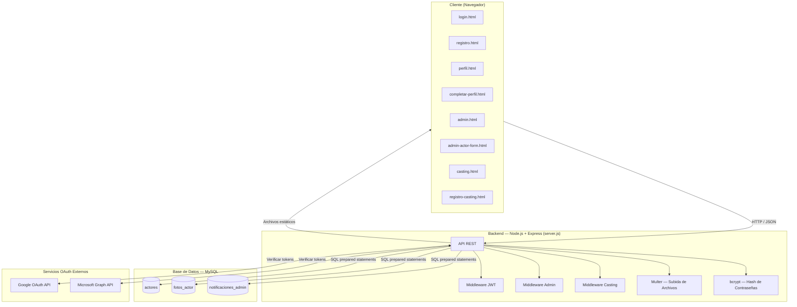
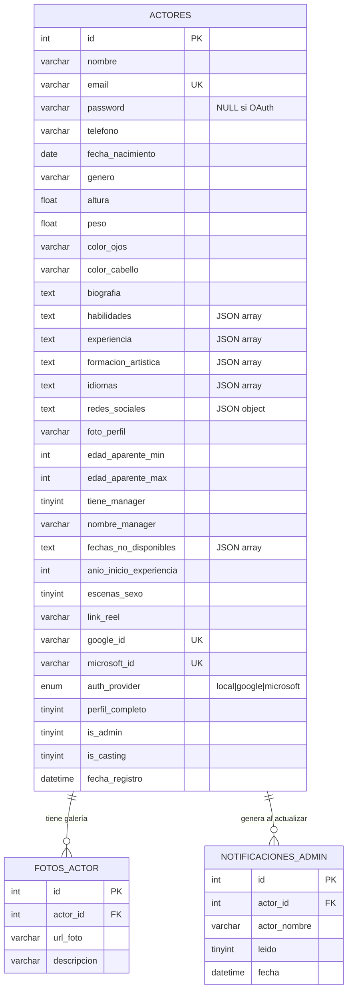
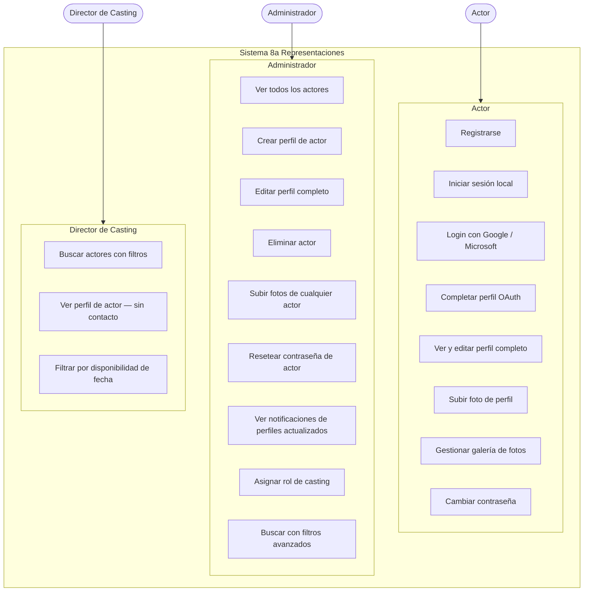
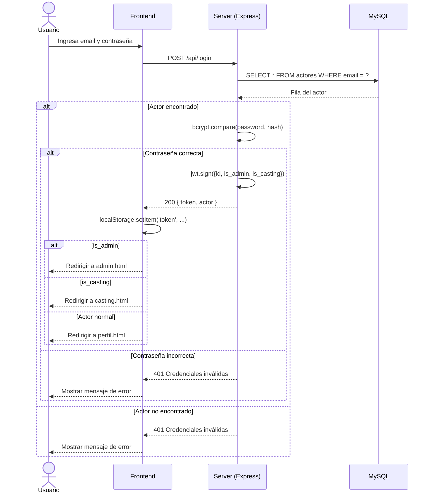
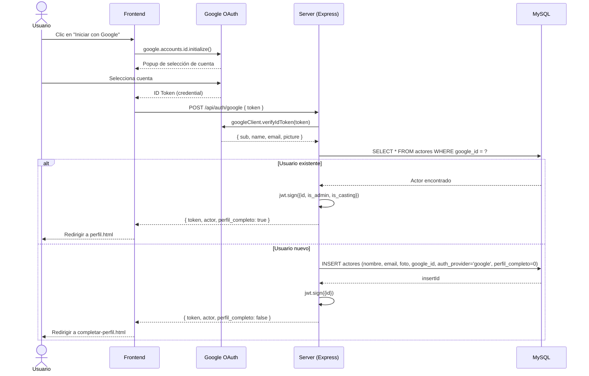
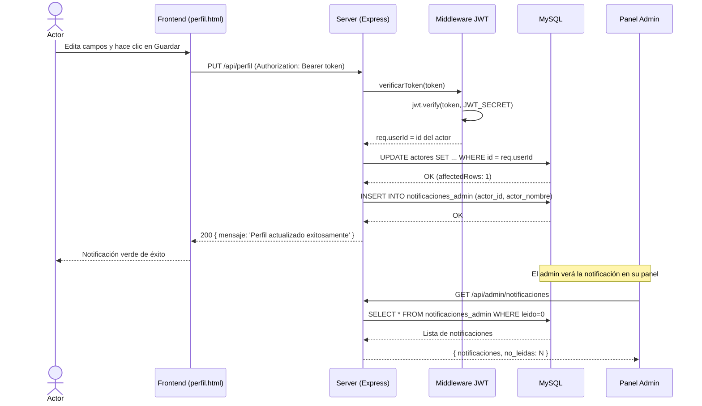
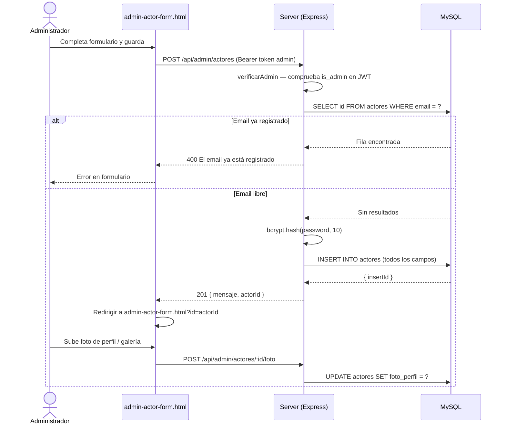
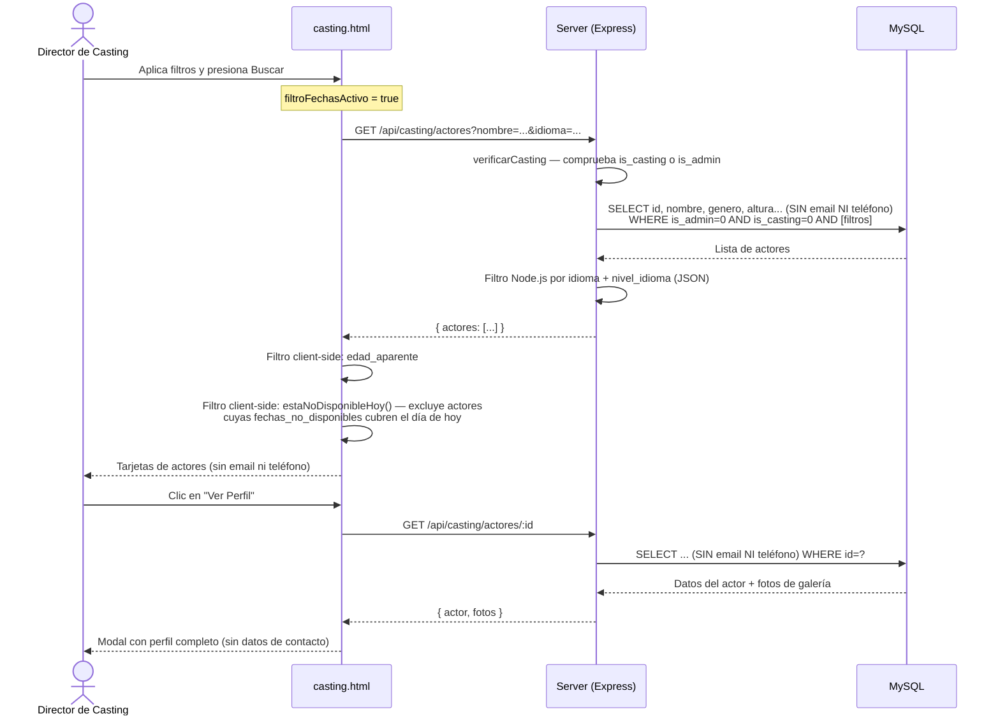
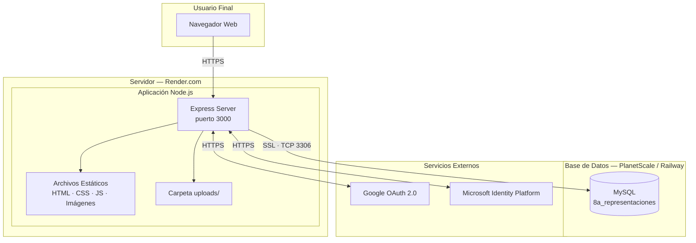
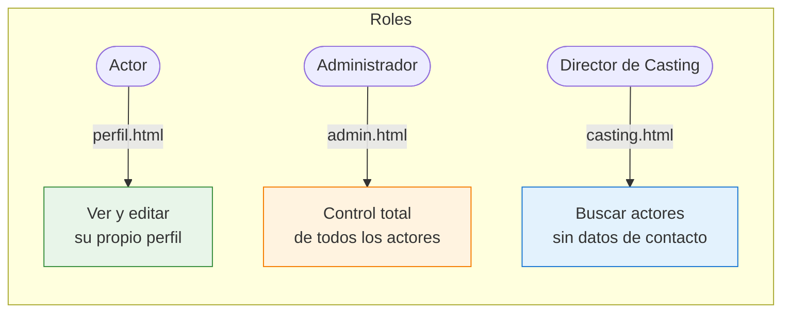

# Diagramas UML — 8a Representaciones

Arquitectura de software del sistema de gestión de actores.

---

## 1. Diagrama de Componentes (Arquitectura General)

---

## 2. Diagrama Entidad-Relación (Base de Datos)

---

## 3. Diagrama de Casos de Uso

---

## 4. Diagrama de Secuencia — Login Local

---

## 5. Diagrama de Secuencia — Login con Google OAuth

---

## 6. Diagrama de Secuencia — Actualización de Perfil

---

## 7. Diagrama de Secuencia — Admin crea perfil de actor

---

## 8. Diagrama de Secuencia — Búsqueda en Panel de Casting

---

## 9. Diagrama de Despliegue

---

## Resumen de Roles y Accesos

